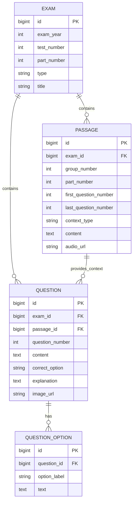
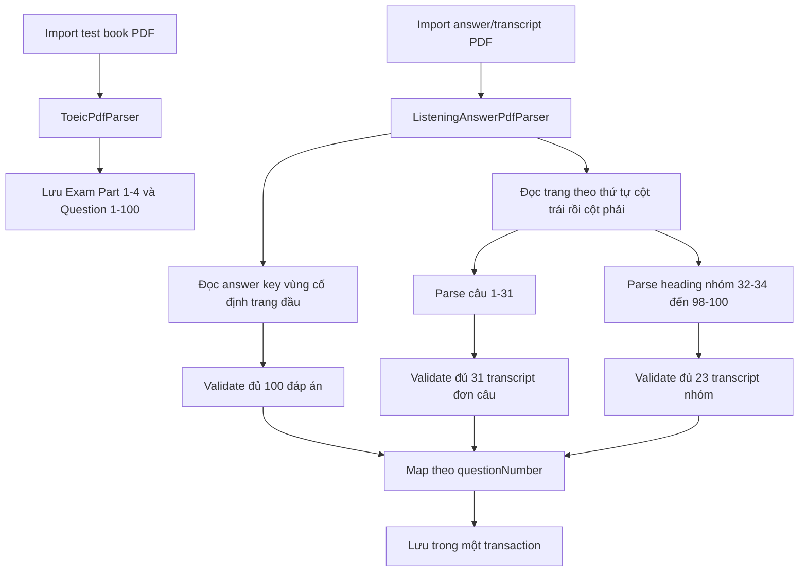
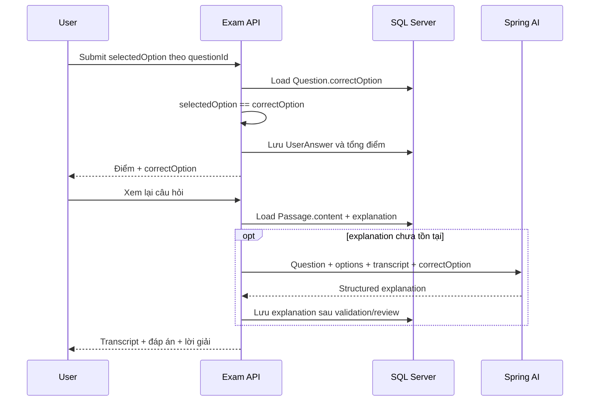

# Listening Answer & Transcript Parsing

## 1. Mục tiêu

Module nhận hai tài liệu độc lập cho một bài Listening:

1. Test book PDF: tạo cấu trúc Part 1-4 và 100 câu hỏi.
2. Answer/transcript PDF: bổ sung đáp án đúng, nội dung được phát trong audio và transcript dùng chung cho nhóm câu Part 3/4.

File `TRANSCRIPT-6-34.pdf` đã kiểm tra có 29 trang và cấu trúc:

- Trang đầu: answer key câu 1-100.
- Part 1: bốn mô tả A-D cho từng ảnh, câu 1-6.
- Part 2: câu dẫn và ba phản hồi A-C, câu 7-31.
- Part 3: 13 transcript, mỗi transcript dùng cho ba câu, câu 32-70.
- Part 4: 10 transcript, mỗi transcript dùng cho ba câu, câu 71-100.

## 2. Mô hình dữ liệu JPA



### `ExamEntity`

- `@Entity`, `@Table(name = "exams")`.
- Unique key `(exam_year, test_number, part_number)`.
- `@OneToMany(mappedBy = "exam", cascade = ALL, orphanRemoval = true)` với `QuestionEntity` và `PassageEntity`.

### `PassageEntity`

`PassageEntity` biểu diễn cả Reading passage và Listening transcript:

```text
contextType = READING_PASSAGE       -> content là đoạn đọc
contextType = LISTENING_TRANSCRIPT  -> content là transcript bài nghe
```

- `@ManyToOne(fetch = LAZY)` tới `ExamEntity`.
- `@OneToMany(mappedBy = "passage")` tới các câu hỏi.
- `@Column(columnDefinition = "TEXT")` cho `content`.
- `audioUrl` giữ URL audio thay vì binary/base64.
- `firstQuestionNumber` và `lastQuestionNumber` tạo mapping rõ ràng, không suy luận từ thứ tự list.

Mapping theo Part:

| Part | Passage/Transcript cardinality |
|---|---|
| 1 | Một context cho một câu/ảnh |
| 2 | Một context cho một câu hỏi-phản hồi |
| 3 | Một transcript cho ba câu |
| 4 | Một transcript cho ba câu |
| 5 | Câu độc lập, `passage_id` có thể null |
| 6-7 | Một passage cho một nhóm câu |

### `QuestionEntity`

- `@ManyToOne(fetch = LAZY, optional = false)` tới `ExamEntity`.
- `@ManyToOne(fetch = LAZY)` tới `PassageEntity`; nullable cho câu không cần context.
- `@OneToMany(mappedBy = "question", cascade = ALL, orphanRemoval = true)` với `OptionEntity`.
- `correctOption`: label A/B/C/D; backend dùng trường này để chấm deterministic.
- `explanation`: `TEXT`, chứa lời giải Admin duyệt hoặc AI sinh sau này.

Không lưu `correct=true/false` trên từng option vì có thể tạo trạng thái mâu thuẫn. Một câu chỉ có một `correctOption` là nguồn dữ liệu chuẩn.

### `OptionEntity`

- `@ManyToOne(fetch = LAZY, optional = false)` tới `QuestionEntity`.
- Unique key `(question_id, option_label)`.
- Nội dung option dùng `@Column(columnDefinition = "TEXT")`.

## 3. Quy trình import và ghép transcript



### Bước xử lý

1. Endpoint `POST /file/import` import test book trước.
2. Endpoint `POST /file/import-listening-answer` nhận `file`, `year`, `testNumber`.
3. Parser cắt riêng vùng answer key bên trái trang đầu để tránh text hai cột bị xen kẽ.
4. Ký tự `C` bị OCR text layer nhận thành `0` hoặc `O` được chuẩn hóa về `C`.
5. Toàn bộ trang còn lại được đọc theo thứ tự: trang N/cột trái, trang N/cột phải.
6. Part 1/2 được nhận diện bằng `questionNumber + speaker code`; option set đầu tiên là tiếng Anh, phần dịch/giải thích phía sau bị loại bỏ.
7. Part 3/4 được nhận diện bằng range heading. Số cuối range được dùng để khôi phục số đầu trong trường hợp chữ số sát center gutter bị mất.
8. Answer key được ghép bằng `questionNumber`, không ghép theo index database.
9. Part 1/2 tạo một `PassageEntity` loại `LISTENING_TRANSCRIPT` cho từng câu.
10. Part 3/4 cập nhật `PassageEntity` hiện có; ba `QuestionEntity` cùng tham chiếu một `passage_id`.
11. Chỉ `saveAll` khi đủ 100 đáp án, 31 context đơn và 23 transcript nhóm; lỗi bất kỳ làm rollback toàn bộ transaction.

Hai endpoint import yêu cầu JWT authority `ROLE_admin`.

### Ví dụ mapping Part 3

```text
PassageEntity
  partNumber = 3
  firstQuestionNumber = 32
  lastQuestionNumber = 34
  contextType = LISTENING_TRANSCRIPT
  content = "W: Hey, Oliver..."

Question 32 ─┐
Question 33 ─┼── passage_id = cùng một ID
Question 34 ─┘
```

## 4. Luồng chấm điểm Listening



### Nguyên tắc chấm điểm

- Java/backend chấm bằng phép so sánh label; không gọi AI để quyết định đúng/sai.
- Transcript được trả khi review, không nhất thiết trả trong lúc thi.
- Spring AI chỉ dùng transcript làm context sinh lời giải.
- AI không được thay đổi `correctOption`; đáp án từ PDF/Admin là nguồn chuẩn.
- Với Part 3/4, prompt phải gửi toàn bộ transcript và ba câu trong group để giữ đủ ngữ cảnh.

## 5. Validation và edge cases

- Từ chối answer PDF nếu test book tương ứng chưa tồn tại.
- Từ chối nếu database không đủ bốn Part hoặc 100 câu Listening.
- Từ chối nếu answer key thiếu bất kỳ câu 1-100.
- Từ chối nếu correct label không tồn tại trong option set của câu.
- Từ chối nếu thiếu range transcript hoặc range không liên tục.
- Import lại cùng file cập nhật context cũ, không tạo duplicate passage.
- Nội dung tiếng Hàn trong PDF mẫu có text layer lỗi encoding; implementation chỉ lấy transcript/option tiếng Anh. `explanation` để null cho tới khi Admin nhập hoặc Spring AI sinh lời giải đã được kiểm duyệt.

## 6. Thay đổi persistence

`exam-service` trước đây dùng MongoDB embedded document. Phiên bản này chuyển sang Spring Data JPA/Hibernate và SQL Server để đáp ứng quan hệ `N-1` và annotation JPA:

- `spring-boot-starter-data-mongodb` được thay bằng `spring-boot-starter-data-jpa`.
- Runtime driver sử dụng `mssql-jdbc`, thống nhất với `identity-service`.
- Test dùng H2 ở chế độ tương thích SQL Server.
- Dữ liệu MongoDB cũ không tự động chuyển sang SQL Server; cần migration script riêng trước khi deploy vào database đã có dữ liệu.

## 7. Kiểm thử

- Unit test chuẩn hóa answer key và parse transcript đơn câu.
- Fixture test trực tiếp `TRANSCRIPT-6-34.pdf`: 100 answer, 31 context Part 1/2, 23 group transcript Part 3/4.
- Integration test import test book thật, sau đó import answer PDF và persist bằng Hibernate/H2.
- Kiểm tra đại diện câu 1, 7, nhóm 32-34 và câu 100.
