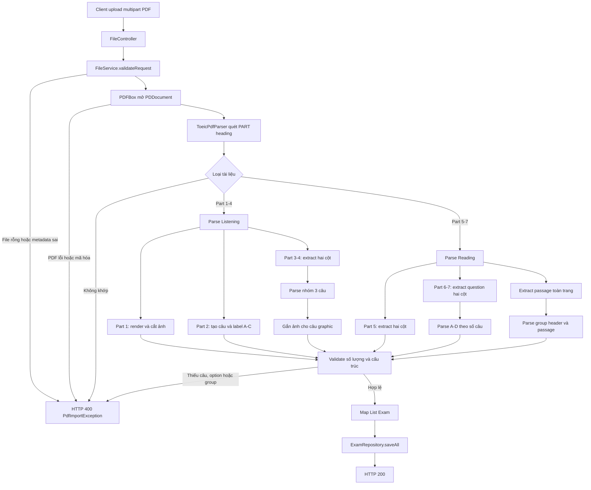

# Báo cáo kỹ thuật - Tính năng upload đề thi TOEIC ETS từ PDF

## 1. Phạm vi và kết quả

Tính năng nhận file PDF đề TOEIC ETS, tự nhận diện tài liệu Listening hoặc Reading, trích xuất dữ liệu và ánh xạ thành các document `Exam` để lưu vào MongoDB.

Phạm vi hiện tại:

- Listening: Part 1-4, câu 1-100.
- Reading: Part 5-7, câu 101-200.
- Hỗ trợ đề Listening và Reading được upload thành hai file riêng.
- Hỗ trợ PDF có text layer; fallback sang Tesseract OCR nếu trang không có text.
- Không tự suy đoán đáp án hoặc transcript không tồn tại trong tài liệu nguồn.

Kết quả kiểm thử trên bộ ETS mẫu:

| Phần | Số câu |
|---|---:|
| Part 1 | 6 |
| Part 2 | 25 |
| Part 3 | 39 |
| Part 4 | 30 |
| Part 5 | 30 |
| Part 6 | 16 |
| Part 7 | 54 |
| **Tổng** | **200** |

## 2. Danh sách lỗi và nguyên nhân gốc rễ

| STT | Lỗi | Nguyên nhân gốc rễ |
|---:|---|---|
| 1 | Upload file Listening nhưng hệ thống vẫn cố parse Part 5-7; <br/>upload Reading lại cố parse Part 1-4 | `FileService` cũ luôn gọi toàn bộ `parsePart1()` đến `parsePart7()` cho một file, không nhận diện loại tài liệu trước khi parse. |
| 2 | Nội dung câu hỏi ở trang hai cột bị xen kẽ | `PDFTextStripper` toàn trang đọc theo thứ tự content stream hoặc theo tọa độ ngang, không bảo đảm đọc hết cột trái rồi mới đến cột phải. |
| 3 | Passage Part 6/7 bị đảo hoặc cắt sai | Một thuật toán chia đôi trang được dùng cho cả câu hỏi hai cột và passage toàn chiều rộng. Hai loại layout cần hai chiến lược extraction khác nhau. |
| 4 | Không đọc được câu Part 6 | Số câu xuất hiện lần đầu tại vị trí ô trống trong passage và lần thứ hai tại khối đáp án. Parser cũ luôn chọn lần xuất hiện đầu tiên, nơi chưa có A-D. |
| 5 | Mất câu 100 | Ký tự `1` của `100.` nằm sát đường chia cột; PDFBox trả `1` ở cột trái và `00.` ở cột phải. |
| 6 | Câu thiếu option vẫn được bỏ qua và đề vẫn được lưu | Parser trả `null` rồi caller bỏ qua câu lỗi; không có bước kiểm tra đủ dải câu và đủ lựa chọn A-D. |
| 7 | Database chứa một phần đề khi parse Part sau thất bại | Từng `Exam` được gọi `repository.save()` ngay sau khi parse, trước khi toàn bộ file được kiểm tra. |
| 8 | Mọi lựa chọn đều có `correct=false` dù PDF không chứa answer key | `false` bị dùng thay cho trạng thái “chưa biết”, làm sai nghĩa dữ liệu. Trạng thái đúng phải là `null`. |
| 9 | Part 1/2 có danh sách lựa chọn rỗng | Nội dung lựa chọn được phát bằng audio và không in trong test book; code cũ không tạo các label cần thiết cho UI. |
| 10 | Mất graphic của một số câu Listening | Parser chỉ lưu text; câu “Look at the graphic” cần giữ lại hình ảnh/bố cục trên trang nguồn. |
| 11 | Không có nơi lưu transcript | `QuestionGroup` chỉ có `passage`, `audioUrl` và `questions`; thiếu trường biểu diễn transcript của conversation/talk. |
| 12 | Lỗi PDF bị trả thành lỗi hệ thống chung | Controller bắt mọi `Exception` rồi bọc lại bằng `RuntimeException`, làm mất thông tin nguyên nhân và trả response không chính xác. |
| 13 | File rỗng, PDF mã hóa hoặc PDF không phải ETS không được kiểm tra rõ ràng | Thiếu validation tại biên upload và thiếu exception chuyên biệt cho nghiệp vụ import PDF. |
| 14 | Maven báo `MalformedInputException` trước khi compile | `application.properties` chứa byte ISO-8859-1/Windows encoding trong khi Maven đọc resource bằng UTF-8. |

## 3. Các thay đổi Code và Architecture

### 3.1. Tách trách nhiệm service và parser

Kiến trúc cũ đặt upload, PDF extraction, regex parsing, dựng entity và lưu database trong một `FileService` lớn.

Kiến trúc mới:

| Thành phần | Trách nhiệm |
|---|---|
| `FileController` | Nhận multipart request và chuyển dữ liệu sang service. |
| `FileService` | Validate request, mở/đóng PDF, gọi parser và lưu kết quả. |
| `ToeicPdfParser` | Nhận diện loại đề, extraction, parsing, validation và ánh xạ Entity. |
| `PdfImportException` | Biểu diễn lỗi nghiệp vụ import PDF. |
| `GlobalExceptionHandler` | Chuyển lỗi import thành HTTP 400 với message cụ thể. |
| `ExamRepository` | Lưu danh sách Part sau khi toàn bộ dữ liệu đã hợp lệ. |

Việc tách `ToeicPdfParser` giúp thuật toán có thể kiểm thử độc lập, không cần khởi động MongoDB hoặc HTTP layer.

### 3.2. Thay đổi mô hình dữ liệu

#### `Exam`

Mỗi Part tiếp tục được lưu thành một document `Exam`:

```text
Exam
├── year
├── testNumber
├── partNumber
├── type: LISTENING | READING
├── title
├── questions[]       // Part 1, 2, 5
└── groups[]          // Part 3, 4, 6, 7
```

#### `QuestionGroup`

Đã bổ sung `transcript`:

```text
QuestionGroup
├── groupNumber
├── passage           // Part 6/7
├── transcript        // Part 3/4, null nếu tài liệu không cung cấp
├── audioUrl
└── questions[]
```

#### `Question` và `Option`

- `Question.imageBase64` lưu ảnh Part 1 và ảnh trang nguồn của câu có graphic.
- Part 1 tạo label A-D; Part 2 tạo label A-C dù test book không in nội dung.
- `Option.correct=null` nếu tài liệu không chứa answer key.
- Part 6 dùng nội dung dạng `[131]`, `[132]`, ... để liên kết câu hỏi với vị trí trống trong passage.

Khuyến nghị dài hạn:

- Lưu ảnh/audio trong object storage, Entity chỉ giữ URL để tránh giới hạn 16 MB của MongoDB document.
- Thêm unique index `(year, testNumber, partNumber)` để ngăn import trùng.
- Cân nhắc dùng một `Exam` root chứa `List<Part>`; hiện tại class `Part` và mô hình “mỗi Part là một Exam” đang thể hiện hai hướng thiết kế khác nhau.

### 3.3. Thay đổi thuật toán

#### Nhận diện tài liệu

- Quét heading bằng regex `PART 1` đến `PART 7`.
- Có Part 1-4: tài liệu Listening.
- Có Part 5-7: tài liệu Reading.
- Thiếu tập Part bắt buộc: dừng import.

#### Hai chiến lược extraction

1. **Question extraction:** dùng `PDFTextStripperByArea`, đọc cột trái trước rồi cột phải.
2. **Passage extraction:** dùng `PDFTextStripper` toàn trang với `setSortByPosition(true)` để giữ đoạn văn toàn chiều rộng.

Không dùng một representation chung cho hai loại layout.

#### Parsing câu hỏi

- Tìm tất cả lần xuất hiện của số câu, không chỉ lần đầu.
- Một candidate chỉ hợp lệ khi tìm được option A, B, C, D đúng thứ tự.
- Hỗ trợ khoảng trắng bất thường quanh số câu, dấu chấm và option marker.
- Loại footer/header như `GO ON TO THE NEXT PAGE`, `TEST n`, `PART n`.
- Có xử lý riêng cho số `100.` bị chia qua center gutter.

#### Parsing passage group

- Nhận diện header dạng `Questions 131-134 refer to the following ...`.
- Hỗ trợ dấu `-`, `–`, `—`.
- Kiểm tra các group bao phủ liên tục toàn bộ dải câu Part 6 hoặc Part 7.
- Passage được lấy từ sau group header đến trước câu hỏi đầu tiên của group.

#### Graphic và OCR

- Câu có nội dung chứa `graphic` được gắn ảnh trang nguồn đã render và nén JPEG.
- Nếu PDFBox không tìm thấy text layer, trang được render 220 DPI và gửi qua Tesseract.
- OCR cũng tách cột trái/phải để hạn chế đảo thứ tự câu hỏi.

### 3.4. Thư viện

| Thư viện | Vai trò |
|---|---|
| Apache PDFBox 3.x | Mở PDF, extraction theo trang/vùng, render trang thành ảnh. |
| Tess4J/Tesseract | OCR fallback cho PDF scan không có text layer. |
| Spring Data MongoDB | Lưu các document `Exam`. |
| Lombok | Builder/getter/setter và constructor injection. |
| JUnit 5 + AssertJ | Unit test parser và fixture test trên PDF ETS thật. |

Không dùng Spring AI PDF Reader vì bài toán cần parsing layout và số câu xác định, không phải chia tài liệu thành các chunk ngữ nghĩa. Không cần iText vì PDFBox đã đáp ứng extraction/rendering và tránh thêm ràng buộc license.

## 4. Business Logic Flow



### 4.1. Diễn giải từng bước

1. **Nhận request:** client gửi `file`, `year`, `testNumber` tới endpoint import.
2. **Validate đầu vào:** kiểm tra file không rỗng, năm hợp lệ và test number lớn hơn 0.
3. **Mở PDF:** dùng `RandomAccessReadBuffer` và `PDDocument` trong try-with-resources; resource luôn được đóng.
4. **Nhận diện đề:** parser tìm vị trí các Part để xác định Listening/Reading và phạm vi trang.
5. **Trích xuất nội dung:** chọn extraction toàn trang hoặc hai cột tùy loại dữ liệu; OCR chỉ chạy khi không có text layer.
6. **Parse cấu trúc TOEIC:** đọc số câu, nội dung, A-D, passage và nhóm câu theo dải chuẩn ETS.
7. **Ánh xạ Entity:** tạo `Question`, `Option`, `QuestionGroup` và `Exam`; dữ liệu không tồn tại trong nguồn được để `null`.
8. **Kiểm tra toàn vẹn:** bắt buộc đủ số câu, đủ option và group liên tục. Lỗi ở bất kỳ Part nào sẽ hủy toàn bộ lượt import.
9. **Lưu database:** chỉ gọi một lần `saveAll()` sau khi mọi Part đã parse thành công, hạn chế dữ liệu dở dang do lỗi parser.
10. **Trả response:** thành công trả HTTP 200; lỗi định dạng/nghiệp vụ trả HTTP 400 kèm nguyên nhân.

## 5. Edge cases đã xử lý

- File rỗng, PDF hỏng, PDF có password hoặc không phải cấu trúc ETS.
- PDF scan không có text layer.
- Text xuống dòng hoặc có khoảng trắng bất thường.
- Trang hai cột và passage toàn chiều rộng nằm trong cùng bộ đề.
- Số câu Part 6 xuất hiện trong cả passage và answer block.
- Dấu gạch nối khác nhau trong group heading.
- Thiếu option hoặc thiếu cả câu.
- Header/footer bị nối vào option D.
- Số câu nằm sát center gutter.
- Không có answer key, transcript hoặc nội dung lựa chọn được phát qua audio.

## 6. Kiểm thử và vận hành

- Unit test kiểm tra Part 6 duplicate marker, thiếu option và các loại dấu gạch group header.
- Fixture test đọc trực tiếp hai PDF ETS mẫu và kiểm tra đủ 200 câu.
- Kiểm tra representative content, passage, option, graphic và trạng thái `correct=null`.
- Spring Boot context test xác nhận service, repository và security configuration khởi động thành công.
- Build và test bằng Java 21 theo cấu hình trong `pom.xml`.

